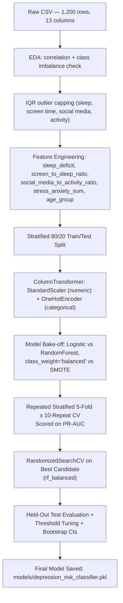

# 🧠 Teen Depression Risk Classification

<p align="center">
  
  
  
  
</p>

<p align="center">
  <b>A severe class-imbalance classification problem, solved honestly.</b><br>
  A Random Forest pipeline that flags depression risk in teenagers from lifestyle and behavioral data —
  built around Repeated Stratified CV, PR-AUC, and bootstrap confidence intervals instead of a single flattering accuracy number.
</p>

---

> ⚠️ **This is a data-science  project, not a diagnostic tool.**
 The dataset, model, and outputs described here are for
> educational/demonstration purposes only and must never be used to assess a real person's mental health. See
> [Ethical Use & Limitations](#-ethical-use--limitations) before doing anything with this beyond learning.

---

## 📋 Table of Contents

- [Why This Project Exists](#-why-this-project-exists)
- [Quickstart](#-quickstart-60-second-onboarding)
- [Architecture — Under the Hood](#-architecture--under-the-hood)
- [Data & Model Details](#-data--model-details)
- [Results](#-results)
- [Repository Structure](#-repository-structure)
- [Ethical Use & Limitations](#-ethical-use--limitations)
- [Contribution & License](#-contribution--license)

---

## 🎯 Why This Project Exists

This project tackles a **1,200-row dataset with only 31 positive cases (2.6%)** — the kind of extreme imbalance where a naive
classifier can hit 97% accuracy by predicting "no" every single time and still be useless. The whole pipeline is designed to
avoid that trap:

- **Repeated Stratified K-Fold CV** (5 folds × 10 repeats = 50 estimates) instead of one train/test split, because 31 positives
  is too few to trust a single split.
- **PR-AUC as the primary model-selection metric**, not ROC-AUC or accuracy — ROC-AUC is misleadingly optimistic once positives
  are this rare.
- **Explicit decision-threshold tuning** against the precision/recall trade-off, instead of defaulting to 0.5.
- **Bootstrap confidence intervals** on every test-set metric, because a point estimate from ~6 positive test examples is not a
  number you can trust on its own.
- **Honest limitation reporting** — including a held-out test score that looks *too* perfect (see [Results](#-results)) and
  exactly why that's a red flag, not a win.

---

## 🚀 Quickstart (60-Second Onboarding)

```bash
# 1. Clone the repo
git clone https://github.com/<your-username>/teen-mental-health-analysis.git
cd teen-mental-health-analysis

# 2. Create and activate a virtual environment
python -m venv venv
source venv/bin/activate        # Windows: venv\Scripts\activate

# 3. Install dependencies
pip install -r requirements.txt

# 4. Launch the notebook
jupyter notebook teen_depression_classification.ipynb
```

The notebook runs top-to-bottom on the bundled dataset (`data/Teen_Mental_Health_Dataset.csv`) — no external downloads or API
keys required.

---

## 🧠 Architecture — Under the Hood

**Tech stack:** `pandas` / `numpy` for data handling · `scikit-learn` for modeling & pipelines · `imbalanced-learn` (SMOTE) for
resampling experiments · `matplotlib` / `seaborn` for visualization · `joblib` for model persistence.

### Pipeline Flow



### Why Random Forest + `class_weight='balanced'` won

Four candidates were compared under identical CV conditions — Logistic Regression and Random Forest, each with either
`class_weight="balanced"` or SMOTE oversampling. **SMOTE was tested but not selected**: `rf_balanced` outperformed `rf_smote`
on PR-AUC (0.9743 vs 0.9402) with lower variance across folds, so the pipeline chose the simpler class-weighting approach over
synthetic minority oversampling.

---

## 📊 Data & Model Details

### Dataset

| Property | Value |
|---|---|
| Source | `Teen_Mental_Health_Dataset.csv` (bundled in `data/`) |
| Rows × Columns | 1,200 × 13 |
| Age range | 13–19 |
| Target | `depression_label` (binary) |
| Class balance | **97.4% negative (1,169)** vs **2.6% positive (31)** |
| Missing values | 0 |
| Duplicate rows | 0 |
| Outliers (IQR method) | 0 detected across sleep, screen time, social media, activity columns |

**Features used:** `age`, `gender`, `daily_social_media_hours`, `platform_usage`, `sleep_hours`, `screen_time_before_sleep`,
`academic_performance`, `physical_activity`, `social_interaction_level`, `stress_level`, `anxiety_level`.

> `addiction_level` was **dropped** — EDA showed it carries no meaningful signal for this target (Pearson r = −0.014).

**Engineered features:**

| Feature | Logic |
|---|---|
| `sleep_deficit` | `max(0, 9 − sleep_hours)` |
| `screen_to_sleep_ratio` | `screen_time_before_sleep / sleep_hours` |
| `social_media_to_activity_ratio` | `daily_social_media_hours / (physical_activity + 0.1)` |
| `stress_anxiety_sum` | `stress_level + anxiety_level` |
| `age_group` | Binned into `13-14`, `15-16`, `17-19` |

**Strongest raw correlates with depression (Pearson r):**

| Feature | r |
|---|---|
| `sleep_hours` | −0.191 |
| `daily_social_media_hours` | +0.175 |
| `stress_level` | +0.170 |
| `anxiety_level` | +0.170 |

### Model

| Property | Value |
|---|---|
| Algorithm | Random Forest Classifier |
| Imbalance handling | `class_weight="balanced"` (selected over SMOTE) |
| Preprocessing | `StandardScaler` (numeric) + `OneHotEncoder` (categorical) via `ColumnTransformer` |
| Hyperparameter search | `RandomizedSearchCV`, 25 iterations, scored on PR-AUC |
| Best params | `n_estimators=100`, `max_depth=None`, `min_samples_leaf=1`, `max_features='sqrt'` |
| Validation strategy | `RepeatedStratifiedKFold` (5 splits × 10 repeats = 50 folds) |

---

## 📈 Results

### Model Comparison (50-Fold Repeated Stratified CV — the trustworthy number)

| Model | PR-AUC (mean ± std) | ROC-AUC (mean ± std) | F1 (mean ± std) |
|---|---|---|---|
| **`rf_balanced`** ✅ | **0.9743 ± 0.0431** | 0.9990 ± 0.0018 | 0.5790 ± 0.2534 |
| `rf_smote` | 0.9402 ± 0.0783 | 0.9973 ± 0.0042 | 0.6247 ± 0.2549 |
| `logistic_balanced` | 0.6961 ± 0.1582 | 0.9785 ± 0.0152 | 0.4802 ± 0.0760 |
| `logistic_smote` | 0.6894 ± 0.1573 | 0.9782 ± 0.0148 | 0.5028 ± 0.1012 |

**`rf_balanced` was selected** for the highest mean PR-AUC with the tightest spread. Note the wide standard deviations across
the board — with only ~31 positive examples total, fold-to-fold variance is real, and models within ~1 std of each other
should be read as statistically indistinguishable rather than a clean ranking.

### Held-Out Test Set (⚠️ read this before trusting it)

| Metric | Value |
|---|---|
| Test PR-AUC | 1.0000 |
| Test ROC-AUC | 1.0000 |
| Test F1 @ tuned threshold (0.18) | 1.0000 |
| Bootstrap 95% CI (2,000 resamples) | (1.000, 1.000) on all three metrics |

<details>
<summary><b>Why a "perfect" score is a caveat, not a headline</b></summary>

<br>

The test set contains **only 6 positive examples out of 240 rows**. A perfect score here means the model correctly separated
6 known cases from 234 negatives on this particular split — not that it will generalize perfectly to new, unseen data at this
same accuracy. Even the bootstrap confidence interval collapses to `(1.0, 1.0)` simply because resampling 6 points 2,000 times
still only draws from those same 6 points.

**The 50-fold cross-validated PR-AUC of 0.9743 is the number to trust.** It's still an excellent result, but it reflects
genuine fold-to-fold variance instead of a lucky split. This gap between CV and test performance is documented here
deliberately — flattering headline numbers without this context would be misleading.

</details>

### Top Feature Importances (Final Model)

| Rank | Feature | Importance |
|---|---|---|
| 1 | `stress_anxiety_sum` | 0.219 |
| 2 | `sleep_deficit` | 0.148 |
| 3 | `sleep_hours` | 0.139 |
| 4 | `stress_level` | 0.138 |
| 5 | `daily_social_media_hours` | 0.124 |
| 6 | `anxiety_level` | 0.100 |

Combined stress/anxiety and sleep-related signals dominate — consistent with the raw correlation analysis and the boxplot
patterns observed during EDA.

---

## 🗂 Repository Structure

```
teen-mental-health-analysis/
├── data/
│   └── Teen_Mental_Health_Dataset.csv
├── models/
│   ├── depression_risk_classifier.pkl
│   └── depression_risk_threshold.pkl
├── teen_depression_classification.ipynb
├── requirements.txt
└── README.md
```

---

## ⚖️ Ethical Use & Limitations

- **Not a diagnostic tool.** This model was trained on a small, likely synthetic dataset (31 total positive cases) and must
  never be used to make real judgments about a real teenager's mental health.
- **Small positive class = fragile estimates.** Every metric in this README, including the CV numbers, carries wider
  uncertainty than the point estimates alone suggest — that's exactly why CV, threshold sweeps, and bootstrap CIs are used
  throughout instead of a single accuracy figure.
- **The perfect test score is a known artifact of test-set size**, not evidence of a flawless model — see the callout in
  [Results](#-results).
- **No causal claims.** Feature importance shows association within this dataset, not causation (e.g., "high social media use
  causes depression" is not something this model can support).
- If you or someone you know is struggling, please reach out to a licensed mental health professional or a local crisis
  line — this repository is a machine learning exercise, not a substitute for care.

---

## 🤝 Contribution & License

Contributions, issues, and suggestions are welcome — feel free to open a PR or an issue.

Distributed under the **MIT License**. See `LICENSE` for details.
